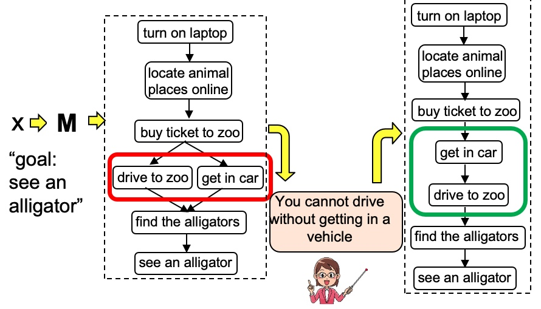
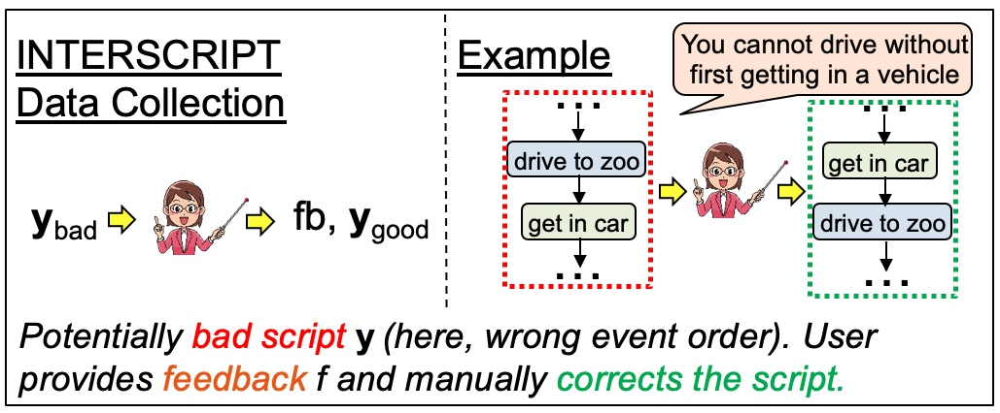

# Interscript

_The Interscript dataset contains interactive user feedback on a T5-11B model generated scripts._




---
## Dataset

- [data.json](data.json) contains the data in an easy to read JSON format. [data.jsonl](data.jsonl) contains the data in a JSONL format. The file contains **8466** samples, one sample per line. Every sample is a JSON object with the following fields:

```json
 {
        "input_script": "push chair in -> pull chair in; pull chair in -> push chair against wall; push chair against wall -> straighten chair legs; straighten chair legs -> Push all chairs in; line up the chairs -> push chair in",
        "input_feedback": "One would not pull chair in if they had initially pushed it in.",
        "output_script": "push chair against wall -> straighten chair legs;straighten chair legs -> Push all chairs in;line up the chairs -> push chair in;push chair in -> push chair against wall",
        "metadata": {
            "id": "301KG0KX9BKTC0HB7Z9SV1Y5HAFH2Y.2_implicit.gp",
            "goal": "push all chairs in",
            "is_distractor": false,
            "feedback_type": "implicit.gp",
            "edit": "Remove node 'pull chair in'",
            "input_script_formatted": [
                "1. line up the chairs",
                "2. push chair in",
                "3. pull chair in",
                "4. push chair against wall",
                "5. straighten chair legs",
                "6. Push all chairs in"
            ],
            "output_script_formatted": [
                "1. line up the chairs",
                "2. push chair in",
                "3. push chair against wall",
                "4. straighten chair legs",
                "5. Push all chairs in"
            ]
        }
    }
```

The description of the fields is as follows:
1. `input_script`: Model generated script $y_{bad}$.
2. `input_feedback`: User feedback on the input script $f$.
3. `output_script`: Fixed output script $y_{good}$.

Metadata contains additional information about the sample. Some important fields are:
1. `id`: Unique identifier of the sample.
2. `goal`: Goal of the script.
3. `is_distractor`: Whether the feedback is a distractor (please see Section 4 for more details).
4. `feedback_type`: Type of feedback (please see Section 4 "Annotation" for more details).
5. `edit`: The `input_feedback` presented as an edit operation on the input script, that is, the edit operation that transforms the input script into the output script.
6. `input_script_formatted`: The input script presented as a list of sentences.
7. `output_script_formatted`: The output script presented as a list of sentences.


----
## Data collection process

- We use Amazon Mechanical Turk to collect feedback on erroneous scripts from users.
- An overview of the process is captured in the following figure:



### Amazon Mechanical Turk Template

- [turk_template.html](turk_template.html) contains the template for Amazon Mechanical Turk HITs.

